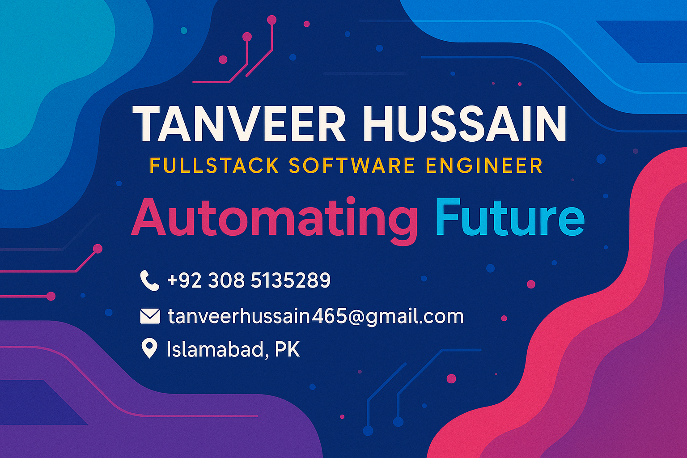

<!--Banner-->

<!--Night Owl image-->

  

<!--Header Name-->
#  ɪ'ᴠTanveer Hussain!  
*Fullstack Developer | Startup Architect | Problem-Solver*
 

<!--Intro-->

I’m a passionate software engineer who thrives at the intersection of tech, innovation, and execution. Whether it’s building backend microservices, wrangling APIs, or crafting user-focused frontend experiences—I love turning ideas into high-impact products.

- 🔭 Currently working as a **Software Engineer**
- 🧠 Building solutions for startups—automation, review platforms, childcare apps, & more!
- 🛠 Skilled in modern stacks: Node.js, React, Sequelize, PostgreSQL, AWS, S3, GraphQL, FastAPI, and more
- 🌱 Lifelong learner. Diving into Golang, systems design, and cloud architecture
- 🧩 Tech focus: *Solving real-world problems with clean, scalable code*
- 💼 Visit my [Portfolio](https://tanveer.is-a.dev) for more

<!--Languages and Tools Section-->
<h2 align="center">🛠️ Tᴇᴄʜɴᴏʟᴏɢɪᴇs & Tᴏᴏʟs</h2>

---

## 🎓 Education

- **Degree:** BS in Computer Science  
  - **Institution:** [COMSATS University Islamabad](https://www.comsats.edu.pk/)  
  - **Graduation Year:** 2023

<!--Daily Quote-->
<h2 align="center">🌟 Tʜᴏᴜɢʜᴛ ᴏғ ᴛʜᴇ Dᴀʏ 🌟</h2>

  

<!--Connect-->
<h2 align="center">🤝 Cᴏɴɴᴇᴄᴛ Wɪᴛʜ Mᴇ</h2>

  
  

 

<!--Footer-->

  

